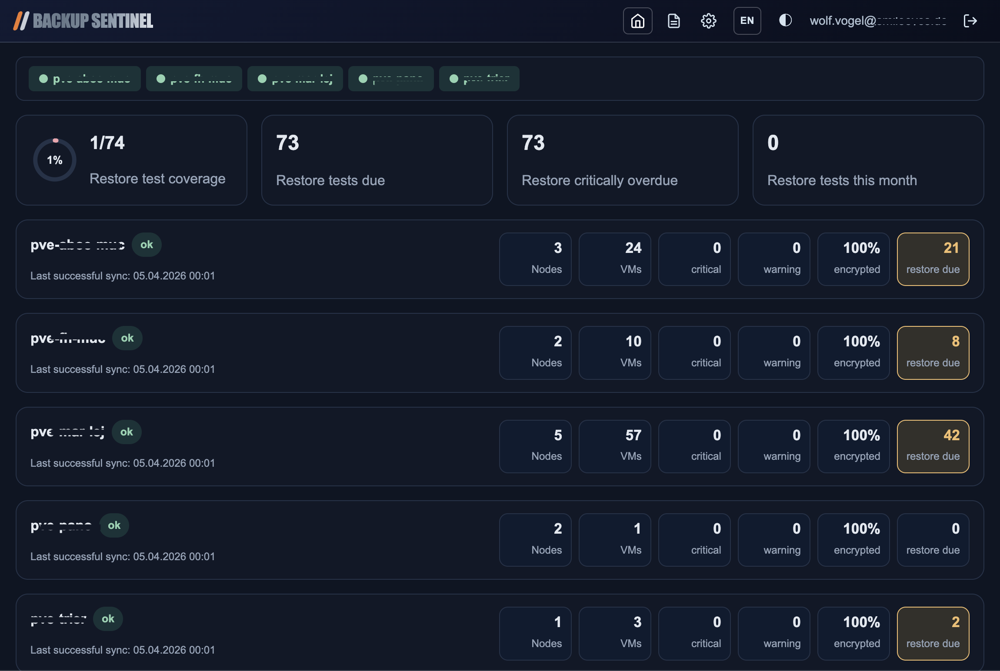
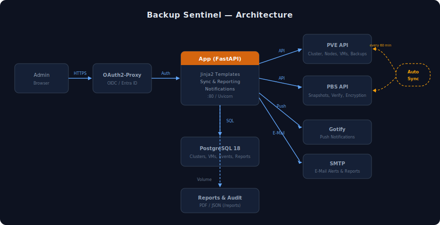

# Backup Sentinel

[](https://github.com/wvogel/backup-sentinel/actions/workflows/ci.yml)
[](https://github.com/wvogel/backup-sentinel/actions/workflows/codeql.yml)
[](https://github.com/wvogel/backup-sentinel/releases)
[](LICENSE)
[](https://www.python.org/)
[](https://fastapi.tiangolo.com/)
[](https://www.postgresql.org/)
[](https://www.docker.com/)
[](https://docs.astral.sh/ruff/)
[](https://github.com/wvogel/backup-sentinel/commits/main)
[](https://github.com/wvogel/backup-sentinel/stargazers)

Compliance-focused monitoring for Proxmox backup infrastructure. Track backup status, encryption, verification, and document restore tests across PVE clusters and PBS instances — aligned with NIST CSF 2.0 and NIS2 requirements.





## Features

- **Dashboard** — Health bar, KPI cards (restore coverage, overdue tests), cluster overview with sync status
- **Cluster Detail** — Per-VM backup status with 30-day sparklines, backup policy overrides, encryption audit
- **Restore Test Documentation** — Record and track recovery tests (full, partial, file-based) for compliance evidence
- **Monthly Reports** — Auto-generated PDF/JSON reports with per-cluster and per-VM breakdown, archive for audit
- **Notifications** — Gotify push and SMTP email alerts for failed syncs, critical backups, and anomalies
- **Multi-cluster** — Monitor multiple PVE clusters and PBS instances from a single dashboard
- **Governance** — NIST CSF 2.0 / NIS2 mapping (Identify, Protect, Detect, Recover)
- **Internationalization** — Full German and English UI with one-click language switching
- **Theme** — Light, dark, and auto (system) modes

## Requirements

- Docker & Docker Compose
- A reverse proxy such as [Nginx Proxy Manager](https://github.com/NginxProxyManager/nginx-proxy-manager)
- [OAuth2-Proxy](https://github.com/oauth2-proxy/oauth2-proxy) for authentication (included in `docker-compose.yml`)
- An OIDC-compatible identity provider (Keycloak, Azure Entra ID, Google, etc.)

## Quick Start

```bash
# Clone and configure
git clone https://github.com/wvogel/backup-sentinel.git
cd backup-sentinel
cp .env.example .env
cp oauth2-proxy.env.example oauth2-proxy.env

# Edit .env and oauth2-proxy.env with your values
# Then start the stack
docker compose up -d
```

The app will be available behind the OAuth2-Proxy on port 4180.

## Configuration

See [`.env.example`](.env.example) for all available environment variables.

| Variable | Description | Default |
|----------|-------------|---------|
| `APP_URL` | Public URL of the application | `https://backup-sentinel.example.com` |
| `DB_NAME` | PostgreSQL database name | `backup_reports` |
| `DB_USER` | PostgreSQL user | `backup_reports` |
| `DB_PASSWORD` | PostgreSQL password | `backup_reports` |
| `BSENTINEL_SECRET_KEY` | Fernet key for encrypting secrets | `changeme` |
| `BSENTINEL_DEFAULT_TIMEZONE` | Timezone for display | `Europe/Berlin` |
| `BSENTINEL_SYNC_INTERVAL_MINUTES` | Auto-sync interval | `60` |

For OAuth2-Proxy configuration, see [`oauth2-proxy.env.example`](oauth2-proxy.env.example).

## Documentation

- [User Guide (English)](docs/user-docs-en.md) · [Benutzerhandbuch (Deutsch)](docs/user-docs-de.md)
- [Admin Guide (English)](docs/admin-docs-en.md) · [Admin-Handbuch (Deutsch)](docs/admin-docs-de.md)
- [Architecture (English)](docs/architecture-en.svg) · [Architektur (Deutsch)](docs/architecture-de.svg)

## Deployment

### GitLab CI/CD

Set these variables in your GitLab project:

| Variable | Description |
|----------|-------------|
| `DEPLOY_USER` | SSH user for deployment |
| `DEPLOY_HOST` | Target server hostname/IP |
| `DEPLOY_PATH` | Path on the server |

All application secrets (`DB_PASSWORD`, `BSENTINEL_SECRET_KEY`, OAuth2 credentials) are configured in `.env` and `oauth2-proxy.env` directly on the server — they are never stored in CI/CD or the repository.

## Project Structure

```
backup-sentinel/
├── app/                  # FastAPI application
│   ├── i18n/             # Translations (en.json, de.json)
│   ├── web/              # Route handlers
│   └── ...
├── templates/            # Jinja2 HTML templates
├── static/               # CSS, JS, favicon
├── scripts/              # Bootstrap shell scripts
├── docs/                 # Documentation and architecture diagrams
├── docker-compose.yml    # Container orchestration
├── Dockerfile            # Application container
├── .env.example          # Environment variable template
└── oauth2-proxy.env.example  # OAuth2-Proxy configuration template
```

## Development

```bash
python -m venv .venv
source .venv/bin/activate
pip install -r requirements.txt

# Run locally (requires PostgreSQL)
uvicorn app.main:app --reload --host 0.0.0.0 --port 8000
```

## License

[MIT](LICENSE) — Copyright (c) 2026 Backup Sentinel Contributors
